# 📈 Retail Sales Forecasting & Business Intelligence

[](https://retail-sales-forecasting03.streamlit.app/)
[](https://www.python.org/)
[](https://github.com/harsh-k03/Retail-Sales-Forecasting/actions/workflows/ci.yml)
[](https://streamlit.io/)
[](https://fastapi.tiangolo.com/)
[](https://www.docker.com/)
[](LICENSE)

An end-to-end demand forecasting platform: **data validation → feature engineering → walk-forward
model comparison → SHAP explanations → recursive forecasts → business recommendations**, served
through a Streamlit dashboard and a FastAPI service.

🔗 **Live demo:** https://retail-sales-forecasting03.streamlit.app/

<p align="left">
  
</p>

---

## ✨ What it does

| | |
|---|---|
| 🔌 **Any retail dataset** | Column mapping lives in YAML — presets for Kaggle *Store Sales*, *Rossmann* and *Walmart*, plus a canonical passthrough |
| 🛡️ **Validation first** | 12 schema and quality rules produce a machine-readable report; errors stop the run, warnings are recorded |
| 🧬 **60+ engineered features** | Calendar, Fourier seasonality, lags, rolling/expanding stats, event lead-lags, promo interactions — all leakage-guarded |
| ⏱️ **Honest validation** | Expanding walk-forward folds only. No shuffling anywhere, asserted in the test suite |
| 🤖 **6 models compared** | Seasonal-naive, RandomForest, XGBoost, LightGBM, CatBoost, Prophet — identical folds, ranked with a skill score vs the baseline |
| 🎯 **Optuna tuning** | Reusable objectives that optimise over the same CV protocol used for reporting |
| 🧠 **SHAP explainability** | Global importance, direction of effect, dependence and per-row waterfall |
| 🔮 **7/30/90-day forecasts** | Recursive multi-step prediction that feeds each step back in as the next lag |
| 💡 **Insight engine** | 10 rules turning history + forecast into ranked, evidence-backed actions |
| 🎛️ **Scenario simulator** | Re-forecast under changed promotion, holiday, spend, inventory or temperature |
| 🖥️ **Dashboard + API** | 11 Streamlit pages and 9 REST endpoints over the same code |
| 🧪 **112 tests** | Unit, integration, leakage, API contract and dashboard smoke tests |

---

## 📊 Results

Walk-forward validation (4 expanding folds × 30-day test windows) on the bundled demo panel
— 5 stores × 4 product families × 730 days.

| Model | RMSE | MAE | MAPE | R² | Skill vs naive |
|---|---|---|---|---|---|
| `prophet` | 47.50 | 28.00 | 8.39% | 0.936 | **+38.6%** |
| `catboost` | 48.80 | 28.37 | 8.38% | 0.933 | +36.9% |
| `xgboost` | 51.18 | 29.42 | 8.52% | 0.927 | +33.9% |
| `lightgbm` | 51.85 | 29.72 | 8.60% | 0.925 | +33.0% |
| `random_forest` | 54.66 | 31.97 | 9.29% | 0.918 | +29.4% |
| `naive` (baseline) | 77.40 | 47.41 | 14.10% | 0.838 | — |

Reproduce with `python scripts/run_pipeline.py`. Full outputs live in [`reports/`](reports/).

| Sales trend | Model comparison |
|---|---|
| 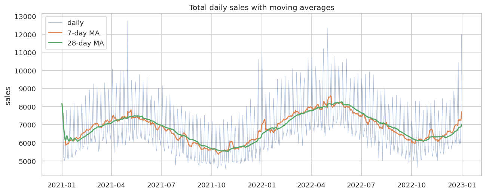 | 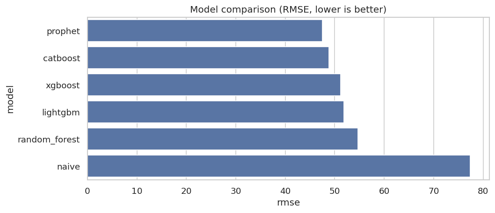 |

| Forecast | SHAP importance |
|---|---|
| 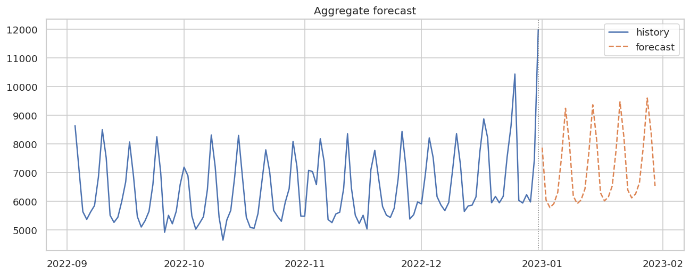 | 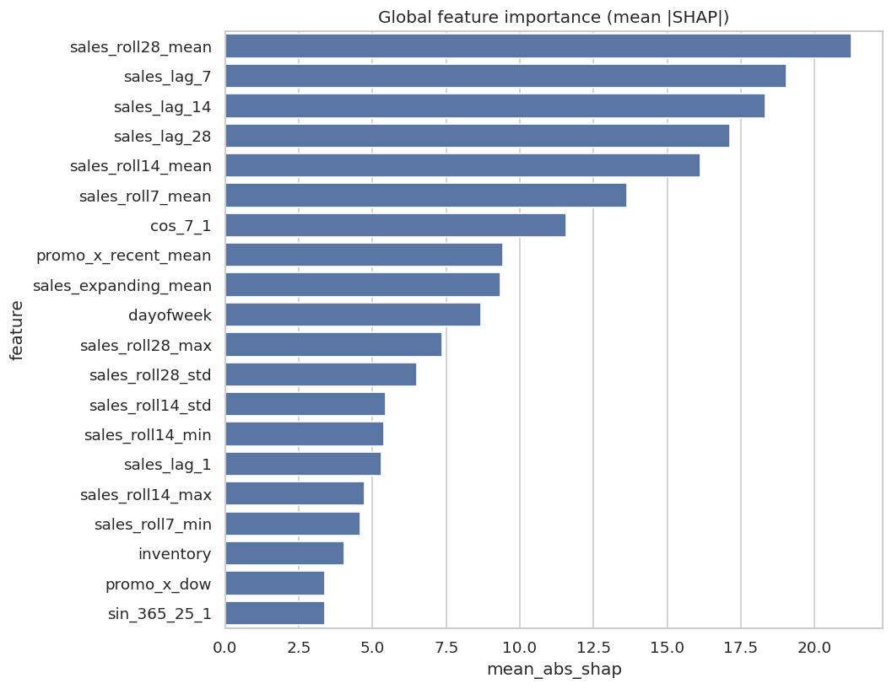 |

Sample recommendations generated from the same run:

> 🟠 **Promotions lift sales 20.5%** — measured across 2,024 promoted rows (13.9% of days).
> *Concentrate promo budget on the highest-uplift product families and peak weekdays.*
>
> 🟠 **Saturday runs 55% above Tuesday** — average sales 444 vs 287.
> *Move shift hours from Tuesday to Saturday.*

---

## 🚀 Quickstart

```bash
git clone https://github.com/harsh-k03/Retail-Sales-Forecasting.git
cd Retail-Sales-Forecasting
pip install -r requirements.txt

python scripts/run_pipeline.py          # train, evaluate, explain, forecast
streamlit run app/streamlit_app.py      # dashboard  -> :8501
uvicorn app.api.main:app --reload       # REST API   -> :8000/docs
```

Or with Docker:

```bash
docker compose up --build               # API :8000 + dashboard :8501
```

### Use the real Kaggle data

The repo ships a small demo file in the Kaggle *Store Sales* schema so everything runs out of the
box. For the real competition data:

```bash
pip install kaggle                      # token in ~/.kaggle/kaggle.json
bash scripts/download_kaggle.sh         # -> data/raw/
python scripts/prepare_kaggle.py        # joins stores / transactions / oil / holidays
python scripts/run_pipeline.py --data data/interim/store_sales_joined.csv --preset favorita
```

Any other dataset works by adding a YAML file to `config/schemas/` — no code change.

---

## 🗂️ Project structure

```
├── app/
│   ├── streamlit_app.py        # dashboard home
│   ├── pages/                  # Upload → Validation → EDA → … → Settings
│   ├── components/             # shared state + Plotly charts
│   └── api/                    # FastAPI app, routers, pydantic schemas
├── config/
│   ├── config.yaml             # paths, features, split, training, forecast
│   ├── model_params.yaml       # defaults + Optuna search spaces
│   └── schemas/                # dataset presets (favorita, rossmann, walmart, canonical)
├── data/                       # raw / interim / processed / sample
├── docs/                       # architecture, data dictionary, design decisions, API, usage
├── models/                     # serialised model bundles
├── notebooks/                  # EDA, feature engineering, model comparison
├── reports/                    # figures, metrics, validation reports
├── scripts/                    # run_pipeline, generate_sample_data, prepare_kaggle, download_kaggle
├── src/
│   ├── config.py  logger.py  utils.py  pipeline.py
│   ├── data/                   # schema, loader, validation, cleaning
│   ├── features/               # calendar, lags, encoders, builder
│   ├── eda/                    # analysis + figures
│   ├── validation/             # walk-forward splitters
│   ├── models/                 # base, naive, tree, prophet, registry, train, tuning, metrics, persistence
│   ├── explain/                # SHAP
│   ├── forecast/               # recursive multi-step
│   └── insights/               # insight engine + scenario simulator
└── tests/                      # 112 tests
```

---

## 🔬 How it works

```
raw file → validate → clean → engineer features → walk-forward CV → compare models
        → refit winner on all history → SHAP → recursive forecast → insights → dashboard / API
```

Three decisions worth calling out:

1. **Rolling statistics are computed on the shifted series**, so row *t* never sees *y_t*. There is
   a test that injects a spike and asserts the spike's own row does not contain it.
2. **Fourier seasonality uses a fixed epoch**, so rebuilding features on a trailing window during
   recursive forecasting cannot shift the phase relative to training.
3. **The model bundle stores its feature contract** — model, fitted `FeatureBuilder` and column
   list travel together, which removes train/serve feature skew.

The full reasoning, including the trade-offs each choice costs, is in
[`docs/design_decisions.md`](docs/design_decisions.md).

---

## 🖥️ Dashboard

Try it live: **[retail-sales-forecasting03.streamlit.app](https://retail-sales-forecasting03.streamlit.app/)**

`Home` · `Upload` · `Validation` · `EDA` · `Features` · `Models` · `Forecast` · `Explainability`
· `Insights` · `Scenario Analysis` · `Settings`

Upload a CSV, watch it validate, explore it, train and compare models, forecast, explain the
drivers, read the recommendations, then pull scenario levers and see the forecast move.

### 📸 Screenshots

| Home | Validation |
|---|---|
| 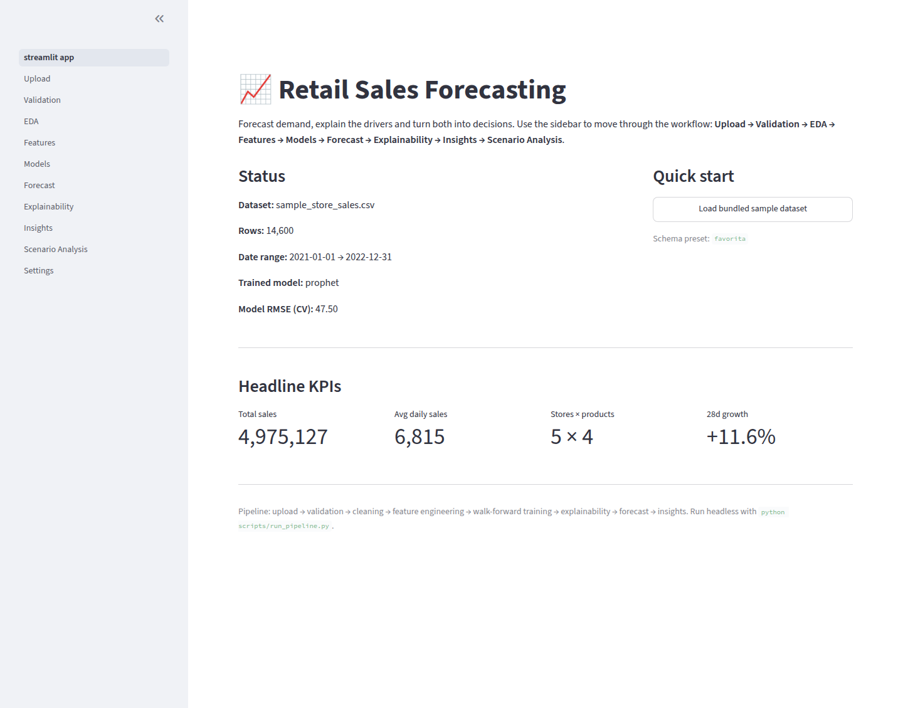 | 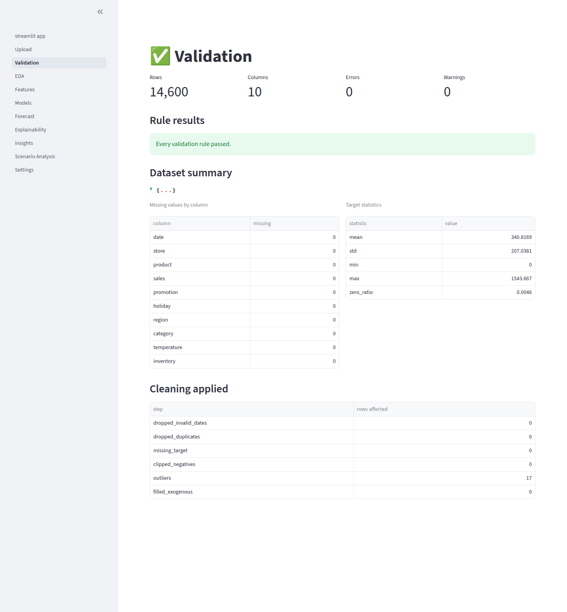 |

| Exploratory analysis | Feature engineering |
|---|---|
| 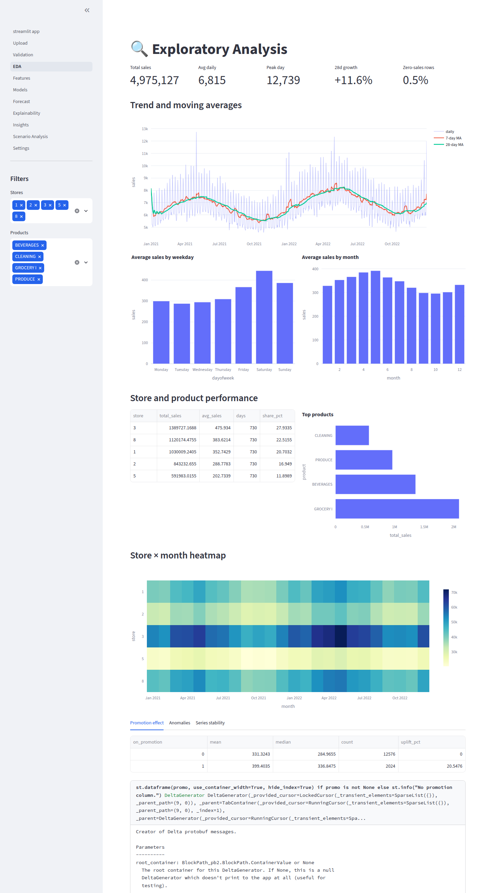 | 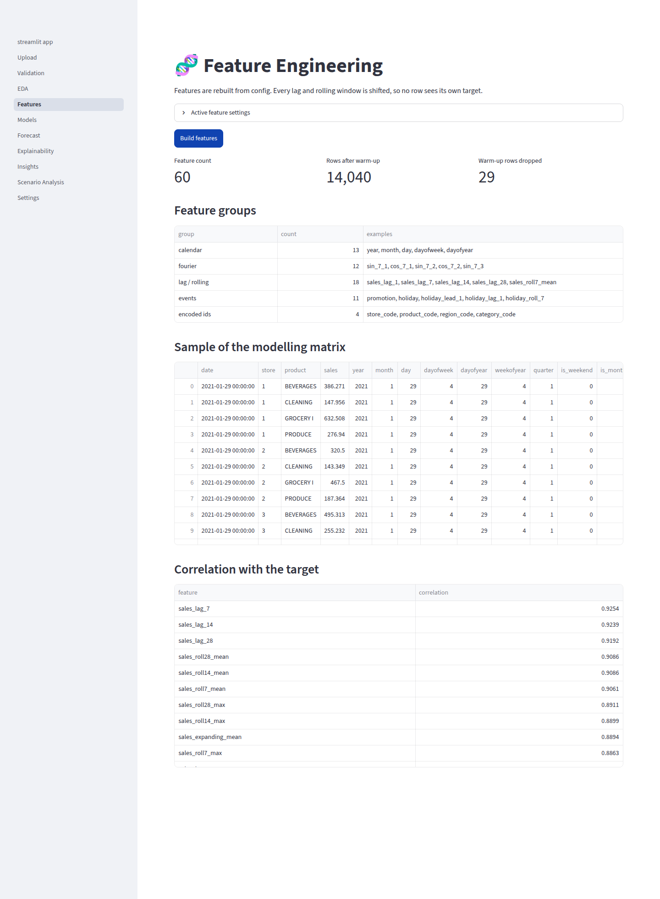 |

| Model comparison | Forecast |
|---|---|
| 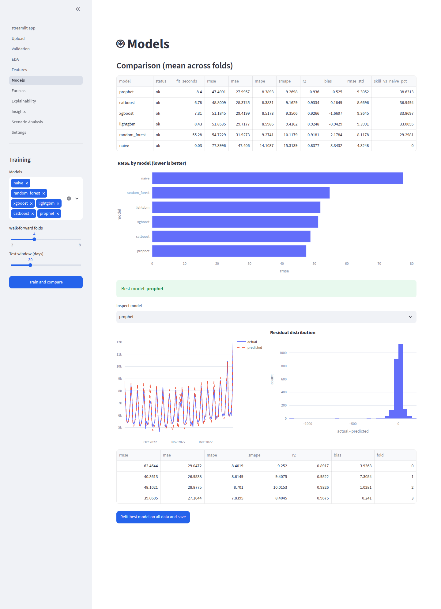 | 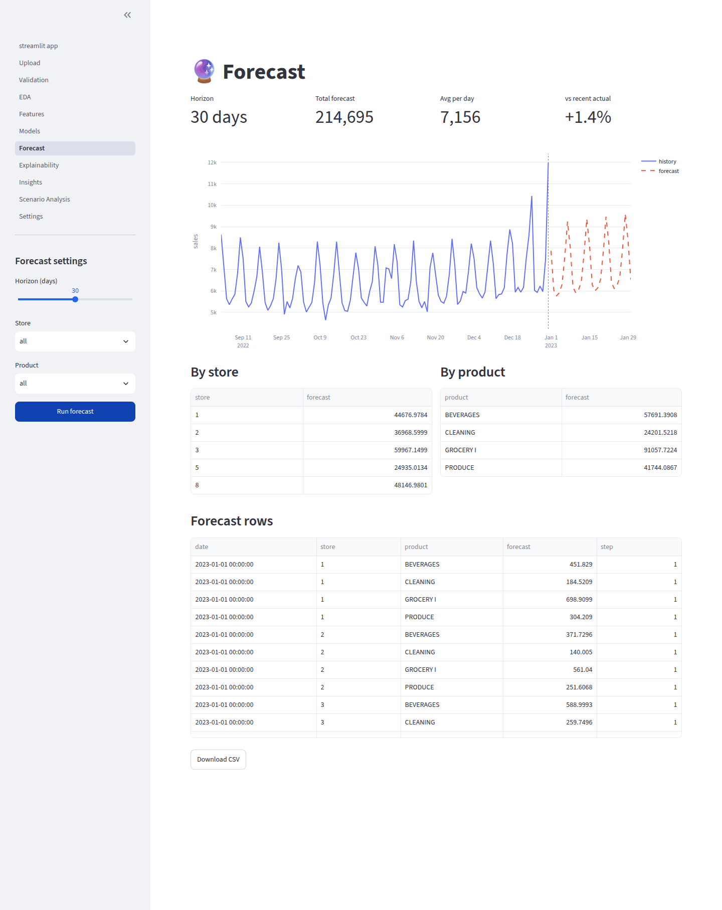 |

| Explainability (SHAP) | Business insights |
|---|---|
| 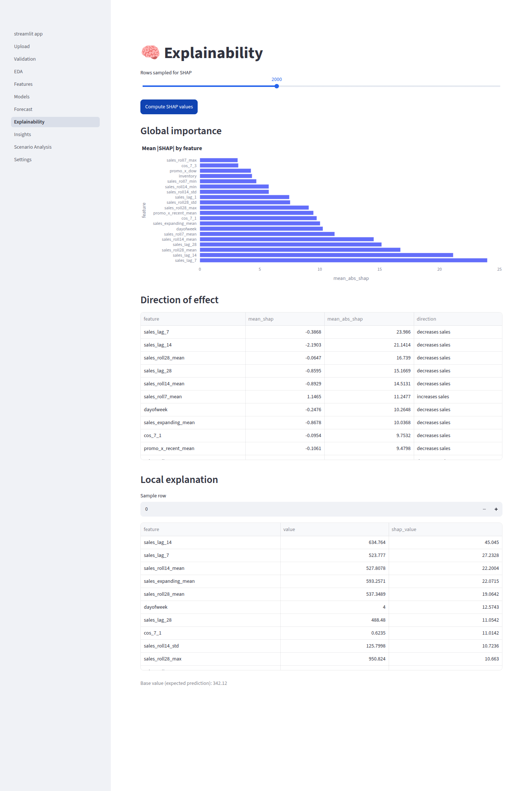 | 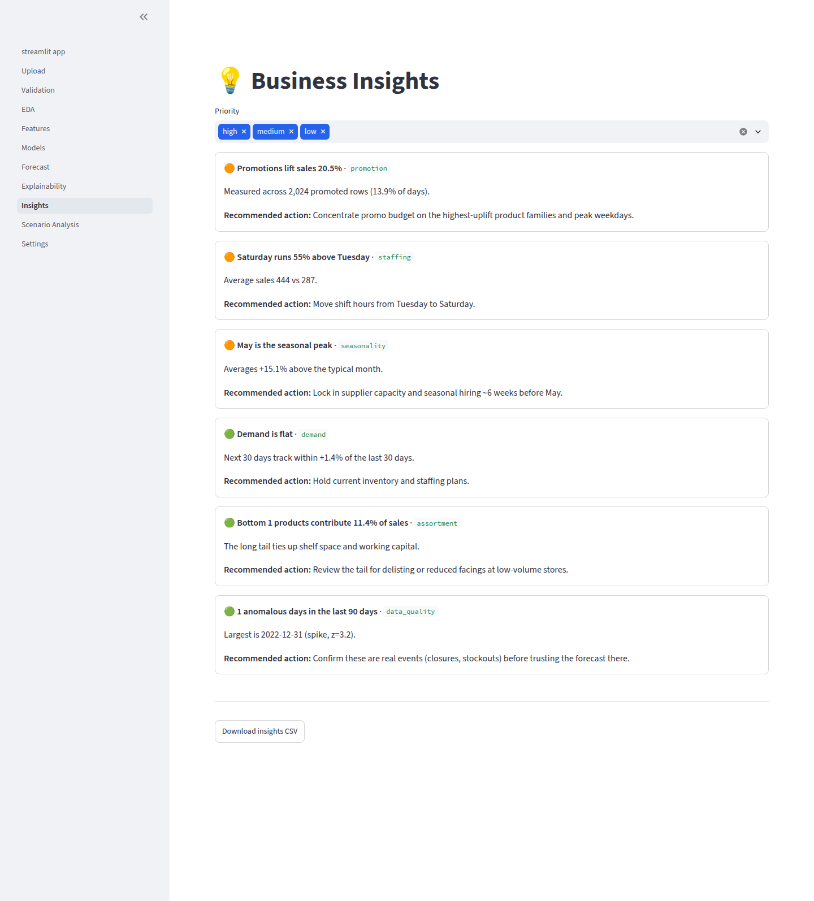 |

| Scenario analysis | REST API (Swagger) |
|---|---|
| 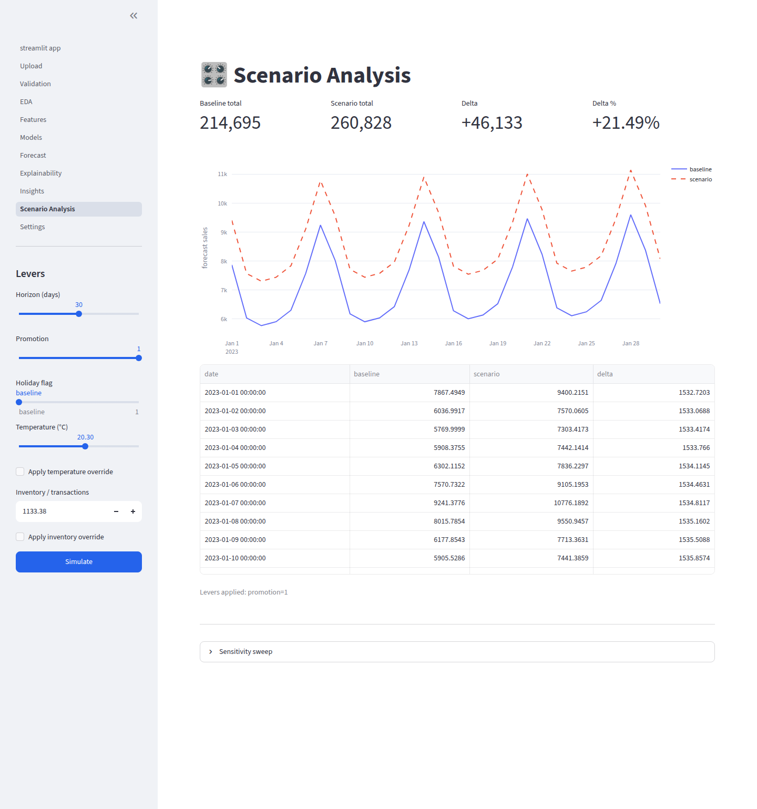 | 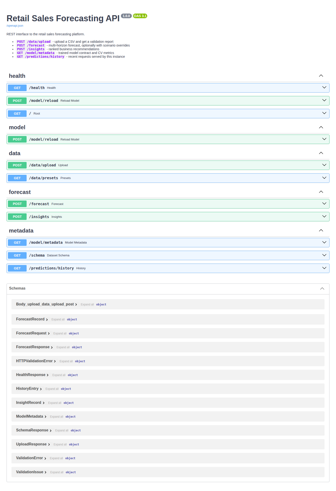 |

More: [Upload](docs/screenshots/02_upload.png) · [Settings](docs/screenshots/12_settings.png)

## 🔌 API

| Method | Endpoint | Purpose |
|---|---|---|
| `GET` | `/health` | Liveness and loaded-model status |
| `POST` | `/data/upload` | Upload a file, get a validation report + `dataset_id` |
| `GET` | `/data/presets` | Available schema presets |
| `POST` | `/forecast` | Multi-horizon forecast with optional scenario overrides |
| `POST` | `/insights` | Ranked business recommendations |
| `GET` | `/model/metadata` | Feature contract and CV metrics |
| `POST` | `/model/reload` | Hot-reload the newest model bundle |
| `GET` | `/schema` | Canonical schema and column descriptions |
| `GET` | `/predictions/history` | Recent requests served |

```bash
curl -X POST http://localhost:8000/forecast \
  -H "Content-Type: application/json" \
  -d '{"horizon": 30, "overrides": {"promotion": 1}, "aggregate": true}'
```

Details in [`docs/api.md`](docs/api.md).

---

## 🧪 Testing

```bash
pytest                 # everything
pytest -m "not slow"   # skip the end-to-end run
pytest --cov=src
```

Coverage includes schema mapping, every validation rule, leakage guards on both features and
splits, metric edge cases (zeros, NaNs), model persistence round-trips, forecast sanity bounds,
insight generation, API contracts and dashboard page smoke tests.

---

## 📚 Documentation

- [Architecture](docs/architecture.md) — layers, data flow, extension points
- [Data dictionary](docs/data_dictionary.md) — canonical schema, presets, features, validation rules
- [Design decisions](docs/design_decisions.md) — why each choice, and what it costs
- [API reference](docs/api.md)
- [Usage guide](docs/usage.md)
- [Milestones](docs/milestones.md)

## 🛣️ Roadmap

- [ ] Prediction intervals (quantile / conformal)
- [ ] MLflow experiment tracking
- [ ] LSTM and Temporal Fusion Transformer comparison
- [ ] Scheduled retraining with drift monitoring
- [ ] Database-backed prediction history and API auth

## 📄 License

MIT — see [LICENSE](LICENSE).

Maintained by [Harsh](https://github.com/harsh-k03).
